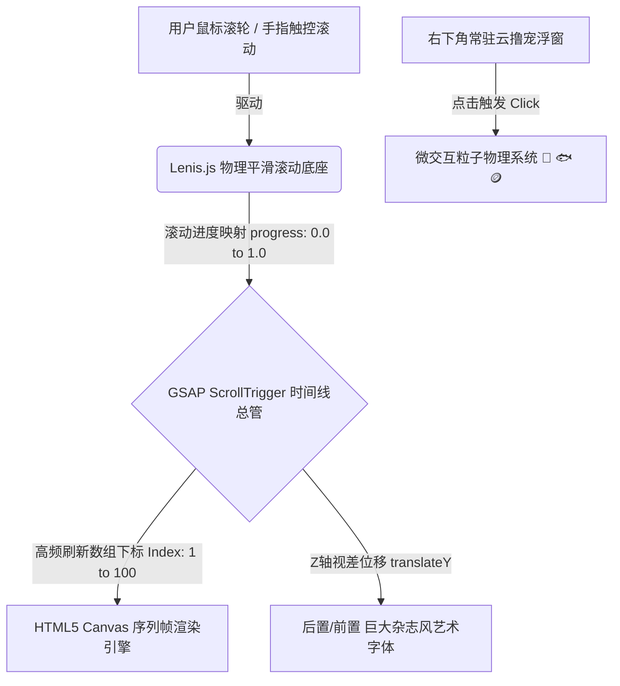

# 宠物独立站高定版：苹果级视差官网 (PetSite Builder Pro) 商业实操白皮书 & SOP

> **项目代号**：PetSite Builder Pro Tier (Apple Grade)
> **文档定位**：副业主理人实操手册、资产准备流水线与标准接单作业程序 (SOP)
> **核心商业模式**：**「零服务器托管成本 + 零实拍资产投入 + AI 组合拳提效 = 近乎 100% 业务净利润」**

---

## 一、 商业定位与重构逻辑 (Executive Summary)

在这个副业中，我们坚决摒弃传统“¥399 基础模板站”的低价内卷打法，通过将前端视觉升级为“苹果官网级视差滚动与游戏化交互”，将交付客单价大幅拉升至 **¥1899 - ¥2999+** 级别。

我们的核心优势在于**「技术红利与资产白嫖的交叉降维打击」**：
1. **零成本服务器**：采用 Next.js 静态打包导出（`output: 'export'`），部署至 Cloudflare Pages 边缘网络。无论页面嵌入了多少高清序列帧，终身免付流量费和服务器月租，卖一单赚一单。
2. **零成本素材库**：不请摄影师、不进摄影棚。依托“AI 绘画 + AI 视频 + 智能抠图”免费组合拳，将普通的宠物静止生活照，在 1 小时内转化为电影感连续动作序列帧。
3. **主理人精力分配**：作为项目操盘手，**你不需要亲自写复杂的底层动画算法**。你的工作 80% 是“调度 AI 工具链”与“把控审美及人设文案”，20% 是“配置参数与客户沟通”。

---

## 二、 基础版 vs 高定商业版断层对比 (Gap Analysis)

| 评估维度 | 基础 MVP 版 (低价走量 / ¥399起) | 商业高定 Pro 版 (苹果级奢品 / ¥1899起) | 核心价值差异与技术重构 |
| :--- | :--- | :--- | :--- |
| **视觉灵魂 (Soul)** | 4 个支持 CSS 样式的**静态 SVG 图标** | **高清纯色背景连续序列帧** (小猫打哈欠、伸懒腰、喝水等流畅动态) | 从“静态平面名片”跃升为“3D/实拍级电影动态艺术展”，建立极高视觉壁垒。 |
| **动画引擎 (Engine)** | 原生 React State + 浏览器简单 Scroll 监听 | **GSAP ScrollTrigger 滚动擦除 (Scrubbing)**，鼠标滚轮精准控制视频帧的播放与倒退 | 赋予网页毫秒级的物理阻尼感，实现“指尖划过，宠物随动”的 WOW Moment。 |
| **页面排版 (Layout)** | 传统功能网格 + 简单 RPG 属性栏 | **杂志级全屏视觉布局 (Editorial Design)**，巨大艺术字体在宠物立绘前后空间交错 | 利用 Z 轴层级穿插，摆脱常规社交媒体的网格化模板感，提升定制仪式感。 |
| **交付成本 (COGS)** | 人工调参约 2 小时，零服务器成本 | **AI 自动流处理约 1-2 小时**，零服务器成本 | 借助现代 AI 工具链，高定版的制作成本并未大幅增加，但利润空间翻了 5-7 倍！ |

---

## 三、 苹果级交互底层技术架构 (Technical Architecture)

为了让网页达到商业广告级的沉浸感，我们采用以下标准现代前端技术栈闭环：



### 1. HTML5 Canvas 序列帧渲染引擎 (Sequence Frame Scrubbing)
* **硬核规矩**：**绝对不要在页面里直接使用 MP4 视频标签！** 普通视频在浏览器中无法随着鼠标的快速上下往复滚动而精准倒放、停顿或加速。
* **实现原理**：
  1. 页面加载时，通过 JavaScript 在后台静默预加载 `frame_001.webp` 到 `frame_100.webp`（共 60~100 张透明背景 WebP 动作帧）进入浏览器内存。
  2. 声明一个全屏 `<canvas>` 画布。
  3. 利用 GSAP 的 `ScrollTrigger` 监听滚动百分比（0.00 至 1.00），将其实时映射为序列帧数组的下标。
  4. 每次滚动时，通过 `ctx.drawImage()` 在画布上高频重绘当前帧。这就彻底实现了“指尖划过多少，猫咪动多少”的极其丝滑的视差表现。

### 2. GSAP (GreenSock) + `@gsap/react` 空间调度
* 弃用原生 CSS 动画，使用 GSAP 统一管理多图层视差。
* 设定空间夹层（Z-index）：例如 `<Layer-1 背景色>` -> `<Layer-2 英文艺术大字>` -> `<Layer-3 Canvas 序列帧猫咪>` -> `<Layer-4 前景猫粮袋遮挡物>`。当鼠标滚动时，文字以 0.5 倍速慢速上升，猫咪以 1.0 倍速正常运动，制造强烈的 3D 裸眼景深。

### 3. Lenis.js 物理平滑滚动底座
* 浏览器原生的滚动条是“跳跃式（Step-by-step）”的，如果直接绑定序列帧会带来严重的卡顿和撕裂感。
* 引入 `Lenis` 库，接管原生滚动，赋予鼠标滚轮类似于智能手机触摸屏般的**“物理惯性与极润阻尼感”**。

---

## 四、 主理人零成本实操 SOP 与 AI 资产流水线

作为主理人，你接到单（或制作样板间）后，请严格按以下 6 步 SOP 推进：

```mermaid
graph TD
    subgraph 阶段一：0元搞定顶级视觉资产 (用时约 45 分钟)
        A1[1. 登录字节即梦AI / Bing Image] -->|输入生图提示词| A2(白嫖 2000px+ 高质感宠物定妆大图)
        A2 -->|上传静止图| A3[2. 登录快手可灵 Kling / Luma]
        A3 -->|输入动作指令: 打哈欠/歪头/伸懒腰| A4(白嫖 4秒 纯色背景动作短视频)
        A4 -->|导入短视频| A5[3. 使用 BiRefNet / 剪映电脑版]
        A5 -->|一键精准抠图 + 抽帧脚本| A6(导出 60~100张 WebP透明序列帧包)
    end

    subgraph 阶段二：人设与杂志风文案提炼 (用时约 15 分钟)
        B1[4. 填写人设词条模板] -->|提炼对立冲突感| B2(确定: 睡眠深度99% / 全自动闯祸机等文案)
    end

    subgraph 阶段三：调度 AI 写代码与工程构建 (用时约 30 分钟)
        C1[5. 打开 Cursor / Windsurf AI编辑器] -->|输入工业级架构 Prompt| C2(AI自动生成 Next.js+GSAP+Canvas 交互网页)
        A6 -->|放进 /public/sequence 目录| C3[6. 启动本地 localhost 预览]
        B2 -->|注入文案参数| C3
        C3 -->|测试滚动擦除与视差| C4{物理阻尼与视觉是否顺滑?}
        C4 -->|存在卡顿/文字重叠| C5[指挥 AI 调整 Lenis/GSAP 缓动参数]
        C4 -->|完美极润| D1
    end

    subgraph 阶段四：零成本上线与引流获客
        D1[7. 执行静态导出 next export] -->|一键发布| D2(托管至 Cloudflare Pages 享受免费全球 CDN)
        D2 -->|手机/PC体验| D3[8. 录制 30秒 视差滚屏高逼格演示短视频]
        D3 -->|搭配营销钩子文案| D4[发布小红书/微信朋友圈: ¥1899 起限量接单!]
    end
```

### 💡 0元白嫖 AI 工具链对照表 (Free AI Toolchain Matrix)

| 执行环节 | 主理人亲手实施的具体动作 (Action) | 推荐白嫖的 AI 工具链 (无需花钱) | 标准化产出物 |
| :--- | :--- | :--- | :--- |
| **Step 1: 定妆画图** | 输入提示词（例：*“一只长毛橘白猫，正脸镜头，毛发蓬松细节清晰，极简纯白背景，电影感棚拍光影 --ar 1:1”*），挑选最传神的一张下载。 | **字节即梦 AI (Jimeng)** <br> **微软 Bing Image Creator** <br> *(每日赠送免费积分，足够出图)* | 1 张 2000px+ 超高清实写风格**宠物定妆大图** |
| **Step 2: 赋予动态** | 将定妆图上传至视频大模型，输入动作词（例：*“猫咪缓慢张嘴打哈欠，头部轻微倾斜，动作极其丝滑自然，纯白背景不闪烁”*），等待极速生成并下载。 | **快手可灵 (Kling AI)** <br> **Luma Dream Machine** <br> *(每日赠送免费算力，白嫖 3-4 段视频)* | 1 段 4~5 秒的纯色背景**高清动作短视频** |
| **Step 3: 抠图抽帧** | 将短片导入开源抠图工具或剪映中去背景，运行免费 Python 脚本或在线工具，将透明视频转换为 24fps 的图片序列，压缩为 WebP。 | **BiRefNet** (GitHub 开源免费去背景) <br> **剪映电脑版** (智能抠像) <br> **在线 WebP 批量转换器** | 60 ~ 100 张连续、透明背景、低体积的 **WebP 序列帧图包** |
| **Step 4: 文案策划** | 结合宠物真实性格，抛弃普通档案，编写对立冲突强烈的人设条目（参考下方模板）。 | 主理人脑暴 / 喂给 **ChatGPT/Claude** 润色 | 1 份拥有对立冲突感、适合大字排版的**杂志风人设文案** |
| **Step 5: 指挥开发** | 打开 AI 代码编辑器，将准备好的工业级 Prompt（参考第六节）发送给 AI，让其自动构建或者配置现有的网页工程。 | **Cursor** / **Windsurf** <br> *(资深 AI 驱动代码编辑器)* | 1 个完美运行在本地 `localhost` 的**高定互动网页工程** |
| **Step 6: 上线引流** | 运行 `npm run build` 导出静态包，一键发布到云托管；录制鼠标划过时猫咪随手指互动的录屏，分发平台接单！ | **Cloudflare Pages** <br> **小红书 / 微信朋友圈 / 抖音** | 1 个零成本全球极速访问的**专属独立站** + 1 条**引流获客短视频** |

---

## 五、 杂志风情绪文案与 RPG 属性模板 (Editorial Copywriting Guide)

高定款必须具备极强的品牌仪式感。在接单沟通时，引导客户填写以下内容，由我们在最终网页中以超大艺术字形式呈现：

### 1. RPG 游戏化战力状态栏 (Stats Panel)
* **睡眠深度**：`99% (24 小时全自动沉睡机)`
* **拆家攻击力**：`MAX (极其擅长重力加速度实验)`
* **掉毛指数**：`一年掉两斤 (随地撒落金黄色蒲公英)`
* **撒娇黏人度**：`零下 10℃ (高冷总裁，摸一次收十块)`

### 2. 杂志风对立冲突金句 (Editorial Headline)
* **习惯特写**：“比起两千块的豪华猫窝，更爱住九块九的快递盒子和行走的行李箱。”
* **反差萌点**：“上辈子绝对是个水桶——爱玩水、爱喝水，哪怕自己的爪子全湿透。”
* **情绪共鸣**：“笑起来确实是治愈全宇宙，但一抱起来就是满身猫毛啊！”
* **哲学人设**：“对对对，你说的都对。只要不耽误我白天睡觉、晚上跑酷就行。”

---

## 六、 工业级 AI 开发指令模板 (Cursor / Windsurf Prompt Template)

在你执行 **Step 5** 时，请复制以下完整提示词直接发送给 AI 代码编辑器（如 Cursor 的 Composer 模式）。这能确保 AI 绝对不会降级使用原生简单动画，而是直接输出符合苹果规范的重型引擎代码：

```text
你是一个精通 Next.js 15 (App Router)、React 19、Tailwind CSS、GSAP (GreenSock) 以及 HTML5 Canvas 动画的资深创意前端架构师。
我现在需要为一只名叫“金币 (Goldie)”的宠物搭建一个“苹果官网级视差滚动擦除 (Sequence Frame Scrubbing)”的高定互动个人主页。

请你帮我编写核心的 `ScrollCanvas.tsx` 组件及主页面布局，要求严格按照以下工业级技术规范执行：

### 1. 核心底座与平滑滚动
- 引入 `@studio-freight/lenis` (或 `lenis`)，在入口组件中初始化平滑物理滚动底座，确保鼠标滚轮具有极其润滑的阻尼惯性。
- 使用 Tailwind CSS 编写无边框、无滚动条边缘破损的全屏响应式布局。

### 2. Canvas 序列帧滚动擦除引擎
- 在组件中声明一个全屏绝对定位/固定定位 (fixed) 的 `<canvas>` 元素。
- 在 `useEffect` 中，使用 JavaScript 在内存中预加载存放于 `/public/sequence/` 目录下的 80 张连续透明背景序列帧图片，命名格式为 `frame_001.webp` 至 `frame_080.webp`。
- 引入 `gsap` 和 `ScrollTrigger` 插件。创建一个绑定整个主页面高度（例如 300vh）的时间线。
- 随着用户的向下滚动（progress 从 0.00 到 1.00），把滚动进度精准映射到 1~80 的图片下标上。利用 `requestAnimationFrame` 或 ScrollTrigger 的 `onUpdate` 回调，使用 `canvas.getContext('2d').drawImage()` 在画布上高频清晰绘制对应下标的图片。要求做到无论正着滚还是倒着滚，画面的切换必须毫无闪烁、极致丝滑。

### 3. Z 轴空间视差排版 (Editorial Parallax)
- 建立明确的图层层级：
  - `z-10`（Canvas 后方）：排版巨大加粗的杂志艺术英文背景字（例如 "DANG DANG"、"SMILE"、"LOW RIDER"），设置文字颜色为微透明渐变。
  - `z-20`（Canvas 前方）：排版宠物的 RPG 游戏化战力状态栏（如“睡眠深度 99%”、“拆家攻击力 MAX”）以及反差萌点文案。
- 给这些文字元素配置 ScrollTrigger 视差动画：当向下滚动时，背景大字以 `y: -150` 的慢速慢于序列帧运动；前景文案以 `y: -300` 的快速运动，产生强烈的裸眼 3D 纵深感。

### 4. 右下角微交互云撸宠中心 (Interactive Overlay)
- 在页面右下角 `z-50` 层级绑定一个悬浮式圆形卡片，内部放入一幅宠物的特写大头贴头像，底部标明“点击抚摸 / 喂食干鱼”。
- 当用户点击该挂件时：
  1. 头像上方弹出气泡文字（如“喵~ 快乐值 +1！”、“干饭人干饭魂！”）。
  2. 调用简单的原生 CSS / JS 粒子函数，从点击位置向屏幕上方随机角度喷射 5~8 个粒子特效（使用 Emoji：💖、🐟、🪙、🐾、Zzz），粒子在上升过程中伴随物理减速和渐隐（fadeOut）。

请直接给出 `ScrollCanvas.tsx` 的 TypeScript 完整实现代码、依赖安装命令，并标注好项目中静态资源的摆放路径说明。
```

---

## 七、 商业落地与变现路线图 (Monetization Roadmap)

### 🚩 第一阶段：全力打磨“样板间 Demo”（第 1 周）
* **唯一目标**：不要急着去找陌生客户！在本周内，严格使用上面的 **0元白嫖工具链**，将第一套样板间【长毛橘白猫：金币 Goldie】在 `localhost` 跑通，并免费部署至 Cloudflare Pages。
* **验收标准**：手机端和 PC 端同时打开，用手指/鼠标划过，猫咪流畅打哈欠，大英文字体在猫咪身前身后视差交错，点击右下角有爱心粒子喷射。

### 🚩 第二阶段：社交媒体炸场获客与引流（第 2 ~ 3 周）
* **执行策略**：用 OBS 或手机屏幕录制一段 30 秒的网页交互演示短视频，突出“手指划一下，猫咪就伸一下懒腰”的丝滑阻尼感。
* **发布平台**：小红书（核心战场）、微信朋友圈、抖音 / 视频号。
* **黄金获客钩子文案**：
  > *“不花三五千，给自家小猫定制一个苹果官网级视差交互的专属数字空间是种什么体验？全世界独一无二的专属域名 + 24小时全自动吸猫官网！拒绝朋友圈千篇一律的九宫格，让主子的可爱在互联网永久定格。#宠物名片 #网站定制 #养猫日常 #云撸猫*
  > *💎 首期特惠：¥1899 起限量接单 5 名，下单即赠送刻有网页实物二维码的【宠物金属黄金项圈吊牌】一件，扫码直达主子官网！”*

### 🚩 第三阶段：副业标准化高时薪交付（长期运作）
* **实物附加利润**：去阿里巴巴 1688 定制一批刻制二维码的宠物金属项圈吊牌/胸针，成本约 ¥8 ~ ¥15/个。将“物理项圈牌 + 数字官网”打包作为 ¥1899 ~ ¥2999 的高定套餐，极大地增强客户的实物获得感。
* **极速交付闭环**：当客户下定金并提供 2-3 张宠物高清日常照后，直接复用这份 SOP 流程：
  `AI 视频生成 -> 自动抽帧 -> 替换 /public/sequence 资源 -> 修改 JSON 文案参数 -> npm run build 一键发布`
  将整个单站的交付工时压制在 **3 小时以内**，真正实现副业高时薪、高净利运营！