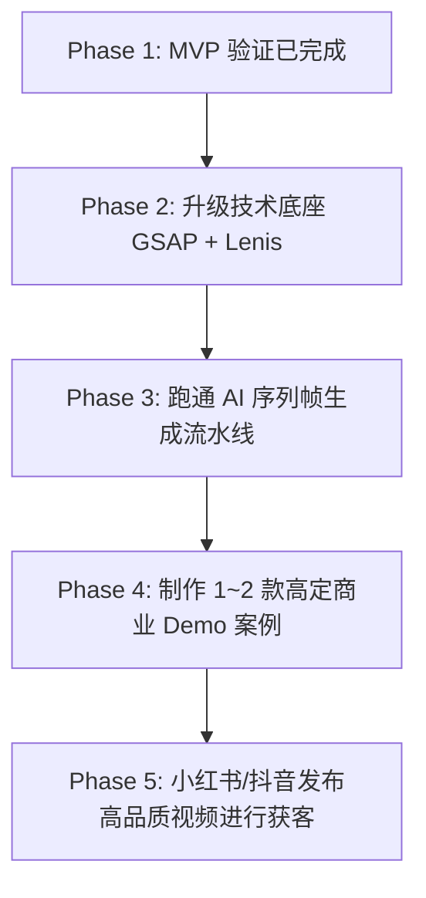

# 宠物高定商业级官网定制服务 (PetSite Builder 2.0) 项目立项书

---

## 一、 项目概述

* **项目名称**：PetSite Builder 2.0 (宠物高定商业级个人官网定制)
* **立项时间**：2026-07-03
* **项目负责人**：xx
* **商业定位**：基于 Next.js 静态建站技术与 Cloudflare 免费云托管，向高端宠主提供**苹果级/商业广告标准**的沉浸式宠物主页设计与部署服务（PWaaS - Premium Web as a Service）。
* **项目口号**：“用苹果官网的交互，记录陪伴我们的毛孩子。”

---

## 二、 核心升级背景与痛点分析

1. **粗制 MVP 与苹果级商业网页的错位**：首期 MVP 验证了“宠物网页”的逻辑可行性，但仅靠静态 SVG 和正弦波蹦跳动画，在视觉上无法突破普通工具站的廉价感，难以驱动宠主付费。
2. **AAA 级商业动态素材的缺失**：高端宠主追求极致的视觉呈现。视频级流畅的宠物动作（打哈欠、伸懒腰、咬球等）不能只靠静态图片堆叠，需要借助**高质量序列帧动画**实现灵动的深度纵深感。
3. **滚动惯性与时间轴擦除**：原生浏览器的滚动是跳跃和生硬的。要复刻顶级品牌的高级阻尼感，必须采用物理平滑滚动底座（Lenis）和重型时间线驱动（GSAP ScrollTrigger）将滚动深度与动画帧进行精细绑定。

---

## 三、 商业模式与升级盈利路径

### 1. 定制服务套餐

* **基础故事版 (¥399 起)**：定制宠物基本档案 + RPG 属性卡 + 简易微交互 + Cloudflare 部署 + 实体项圈二维码挂牌。
* **高定商业沉浸版 (¥1500 - ¥3500+)**：
  * **杂志级全屏视觉排版**：大文字与宠物多图层（z-index）空间交错穿插。
  * **苹果式序列帧擦除动画**：宠物随滚轮精确执行低头、翻滚、打哈欠等流畅动作。
  * **GSAP + ScrollTrigger 全局视差**：全局元素随滚动流深度拉伸或视差浮动。
  * **物理阻尼平滑滚动 (Lenis)**：全站丝滑滚屏体验。
  * **实体周边**：包含精美激光雕刻“黄金/钛钢项圈二维码吊牌”及海报设计。

### 2. 商业优势
* **高客单价、少沟通磨损**：放弃低价走量策略，转攻注重高品质的特定高消费养宠群体，通过高溢价冲抵人工定制耗时。
* **零托管成本**：静态导出文件直接部署至 Cloudflare Pages，维护费为零。

---

## 四、 核心技术栈与视觉流水线 (Technology Stack & Asset Pipeline)

### 1. 技术栈选型
* **核心框架**：Next.js 15 + React 19
* **样式系统**：Tailwind CSS
* **平滑滚动底座**：Lenis.js (提供物理惯性平滑阻尼，消除原生滚动生硬感)
* **动画与时间轴引擎**：GSAP (GreenSock) + ScrollTrigger (高精度调度时间线)
* **部署托管**：Cloudflare Pages (`output: 'export'`)

### 2. 3D/视频级视觉序列帧生成流水线
为解决“AI 无法直接生成流畅交互网页素材”的瓶颈，采用以下生成流水线：
```
[Midjourney 生成宠物多角度定妆照] 
       ↓
[Kling / Luma AI 生成无背景干扰的特定宠物动作视频短片] 
       ↓
[Runway Gen-3 或本地 imgly 一键抠除背景，输出透明通道视频] 
       ↓
[通过 ffmpeg / 脚本将透明视频切分为 100~300 张高压缩比的 WebP 序列帧]
       ↓
[Next.js + GSAP 监听 Scroll 进度，控制 WebP 序列帧 Canvas 擦除播放]
```

---

## 五、 实施与迭代路径



1. **第二阶段 (底座升级)**：集成 GSAP 与 Lenis，重构现有 demo 框架，确保支持基于滚动的序列帧动画及物理滚动平滑。
2. **第三阶段 (素材流水线跑通)**：测试 MJ -> 视频生成 -> 抠像 -> WebP 序列帧的整个过程，建立快速输出素材的模版体系。
3. **第四阶段 (高定案例落地)**：以“李多多”或“金币”为例，制作一款完整、具备苹果官网级别丝滑阻尼和文字重叠图层的终极演示站。

---

## 六、 成本与资源预算

* **工具消耗**：Midjourney / 视频生成 AI 订阅费用（约 ¥150-300/月），包含在定制单价成本中。
* **域名与实物吊牌成本**：实体雕刻挂牌加包装快递费约 ¥30/单。
* **时间投入**：在跑通素材流水线后，依靠 GSAP 现成模版，单站定制周期可控制在 1 天以内，时薪和利润率丰厚。
